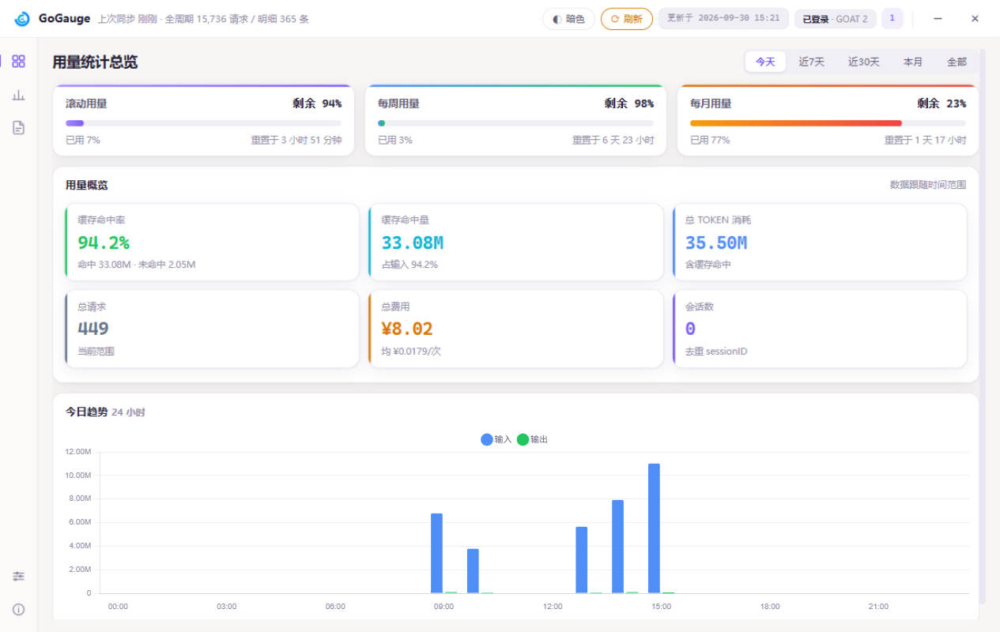
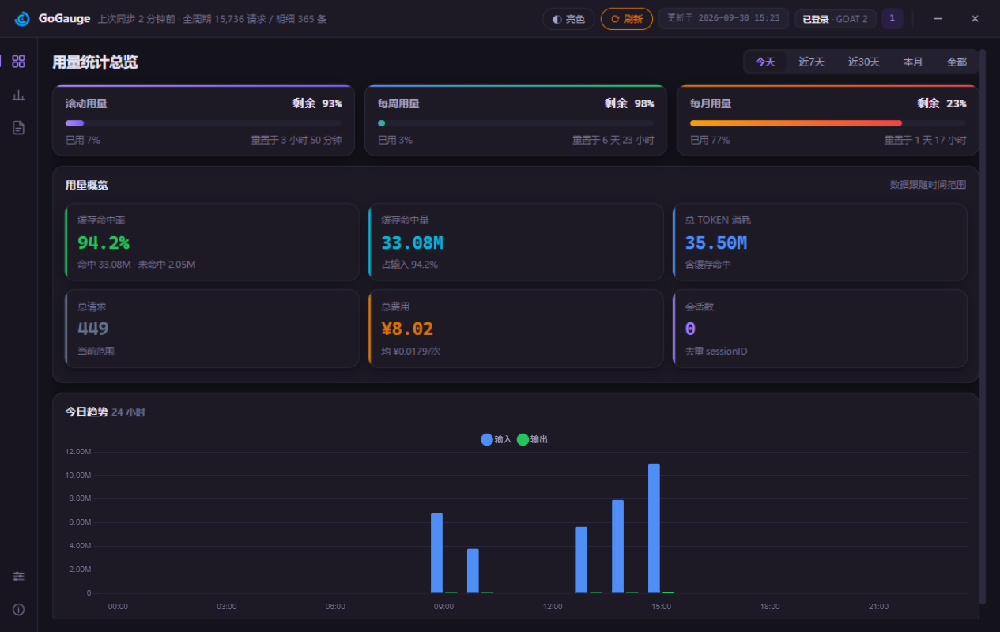
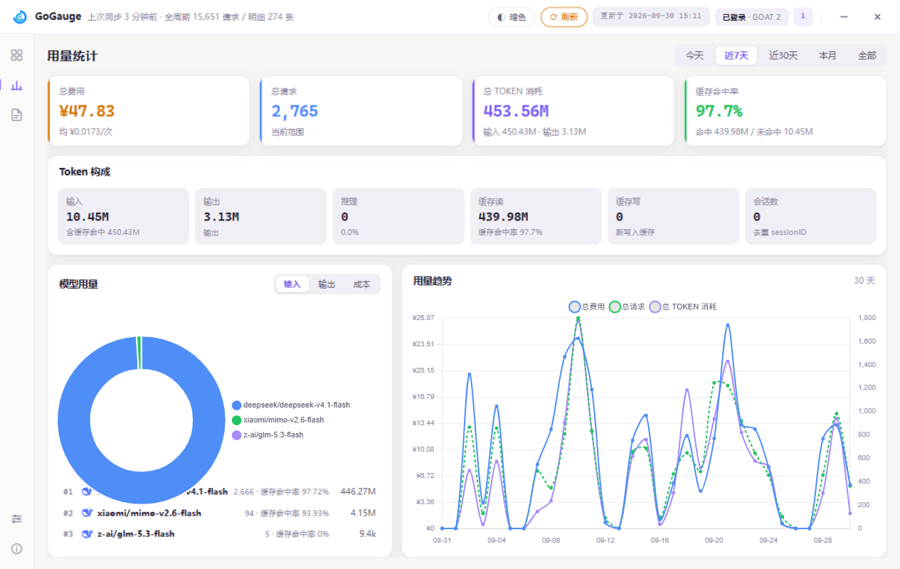
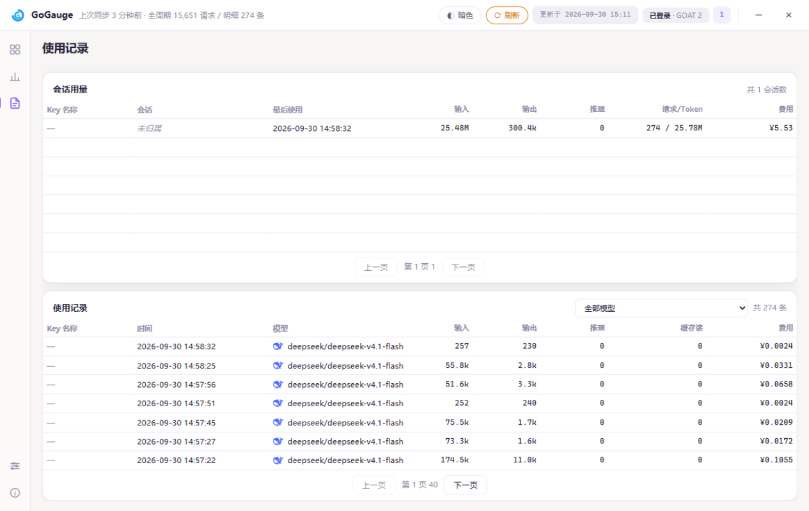
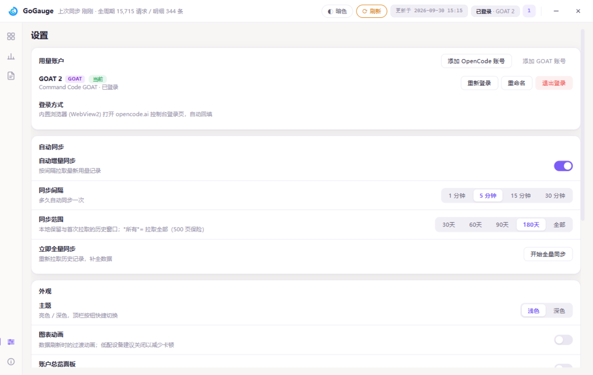
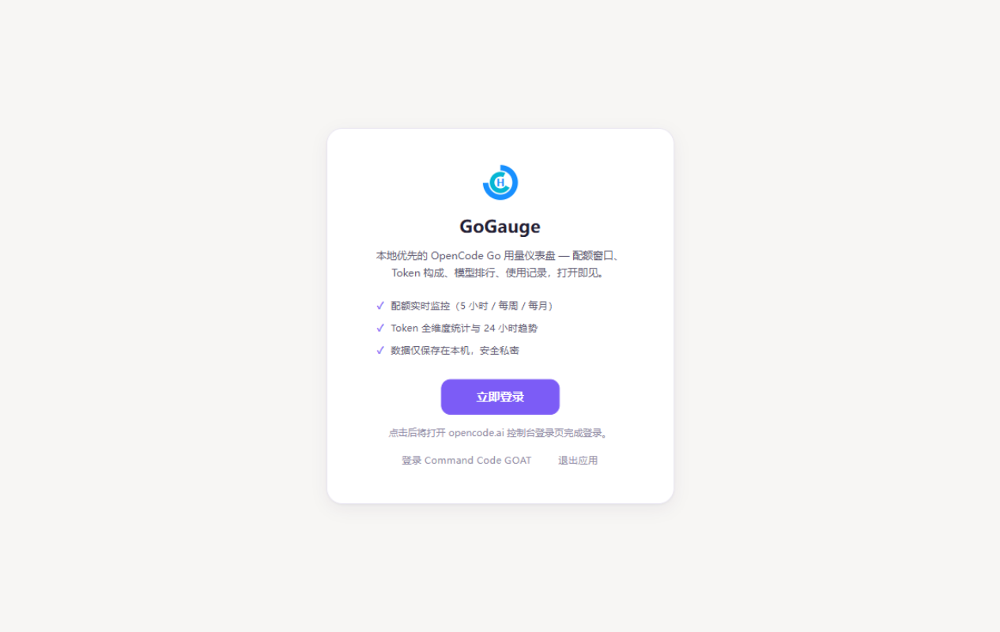
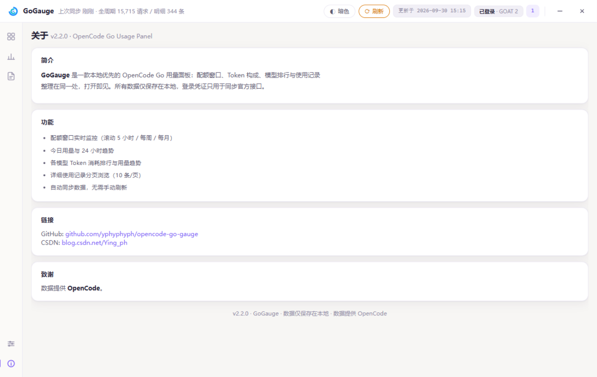

# GoGauge — OpenCode Go Usage Dashboard

<p align="center">
  
</p>

<p align="center">
  <b>A local-first usage dashboard</b>: quota windows, token breakdown, model ranking and usage records — all in one place.
  Supports <b>OpenCode Go</b> and <b>Command Code GOAT</b> plans.
</p>

<p align="center">
  <a href="./README.md">🇨🇳 中文</a>
</p>

> 🔀 This repository is a fork of [yphyphyph/opencode-go-gauge](https://github.com/yphyphyph/opencode-go-gauge),
> adding **macOS** and **Android** support on top of the original Windows app.
> All platform packages (Windows / macOS / Android) are published in this repo's [Releases](releases).

## 🗺 Platform Support

| Platform | Status | Installer | Docs |
|:---:|:---:|:---|:---|
| **Windows** | ✅ Released | [This repo's Releases](releases): `GoGauge-vX.X.X-windows.exe` (single file, no install) | — |
| **macOS** | ✅ Released | [This repo's Releases](releases): arm64 / x86_64 packages (see the actual assets on the Releases page) | [docs/macos.md](docs/macos.md) |
| **Android** | ✅ Released | [This repo's Releases](releases): `GoGauge-vX.X.X-android.apk` (APK sideload) | [android/README.md](android/README.md) |
| **HarmonyOS NEXT** | 🚧 In development (opencode quota / overview / stats / records / multi-account work; Command Code & accounts overview pending) | HAP (build / signing / publishing: [harmonyos/README.md](harmonyos/README.md)) | [harmonyos/README.md](harmonyos/README.md) |

---

## 📸 Screenshots

| Home (Light) | Home (Dark) |
|:---:|:---:|
|  |  |

| Stats | Records |
|:---:|:---:|
|  |  |

| Settings | Login | About |
|:---:|:---:|:---:|
|  |  |  |

---

## ✨ Features

- **Quota monitoring**: 5h rolling / weekly / monthly windows with progress bars, remaining % and reset countdown
- **Usage overview**: cache hit rate / hit amount / total tokens (incl. cache hits) / requests / cost / sessions
- **Today's trend**: 24-hour input / output bar chart
- **Usage stats**: token breakdown (input / output / reasoning / cache read / cache write / sessions), model usage donut + ranking, cost / requests / total tokens triple-line trend; click a donut legend item to exclude a model — KPI cards, token breakdown, ranking and trend all follow, with one-click restore chips on the card header
- **Session history**: per-session aggregation of requests / input / output / reasoning / total tokens / cost, paginated
- **Usage records**: request-level detail with pagination and model filtering, incl. model / key-name columns
- **Multi-account support**: user management (add / switch / rename / remove / re-login), usage isolated per account, key-name column on records & sessions; accounts can come from OpenCode or Command Code (with source badge)
- **Command Code GOAT support**: after logging into a Command Code account, view 5h / weekly / monthly quota windows and request-level details (GOAT source badge)
- **Accounts overview panel**: toggle in settings, aggregates each account's quota windows and today's usage with cross-account summary KPIs and a 7-day cost trend comparison
- **Built-in WebView login**: independent login window opens the opencode.ai console sign-in page, auto-captures session & workspace — no manual copy-paste
- **Auto sync**: incremental sync (1/5/15/30 min) + sync range (30/60/90/180 days / All)
- **Version updates**: the settings page checks GitHub Releases; a new version can be downloaded in-app (`.exe` on Windows, `.zip` on macOS, revealed in Finder), falling back to the release page
- **Dual themes**: light / dark toggle; bilingual UI (中文 / English)
- **System tray / menu bar**: closing the window minimizes to the system tray (Windows) or the menu bar (macOS); brand logo icons
- **macOS extras**: menu-bar quick panel for today's usage (30s refresh), launch-at-login (LaunchAgent) — see [docs/macos.md](docs/macos.md)
- **Local-first**: all data stays in local SQLite; credentials are only used to sync official APIs

## 🖥 Quick Start

### Windows

Download `GoGauge-vX.X.X-windows.exe` (single file, no install) from [Releases](releases):

1. Double-click to run, click "Login Now" on the welcome page — the opencode.ai console sign-in window pops up
2. After login, the dashboard loads and usage data syncs automatically
3. Data is stored in the `data\` folder next to the exe

> Requires Windows 10/11 (WebView2 Runtime built-in). Closing the window minimizes to the system tray; use the tray menu's "Quit" to exit.

> ⚠️ **Upgrading from v2.1.0 or earlier**: opencode.ai switched to its new console API, so the stored session is void. The stale credential is cleared automatically, the app returns to the welcome page — just log in once (local history is kept).

### macOS

Download the package for your architecture (arm64 / x86_64) from [Releases](releases), unzip and drag `GoGauge.app` into "Applications".

> See [docs/macos.md](docs/macos.md) for the menu-bar quick panel, launch-at-login, semi-automatic updates and the Gatekeeper workaround.

### Android

Download `GoGauge-vX.X.X-android.apk` from [Releases](releases) and allow "install unknown apps" to sideload it.

> The Android app is a native Kotlin + Jetpack Compose implementation with the same features as the desktop version —
> build, tech stack and platform differences are documented in [android/README.md](android/README.md).

### From Source

```bash
pip install -r requirements.txt
python entry.py
```

### Build

**Windows**

```bash
build.bat
```

Output: `dist\GoGauge.exe` (~17 MB, --noconsole, logo icon included).

**macOS**

```bash
./build_macos.sh
```

Output: `dist/GoGauge.app` (no console window; `.icns` icon and menu-bar tray support included).

> Requires macOS 11+ (built-in WebKit; pywebview uses WKWebView). Closing the window minimizes to the menu bar.
> Dual-arch builds, dependency locking and CI auto-build are detailed in [docs/macos.md](docs/macos.md).

## 📊 Data Notes

- **Source**: OpenCode Go = opencode.ai console API (`/console/api`) — `go/status` quota + `request-logs` usage detail + `service-accounts` key names; Command Code GOAT = api.commandcode.ai internal API — `billing/credits` / `billing/subscriptions` quota + `usage` / `usage/summary` detail + `usage/charts` per-cycle aggregation
- **Total tokens** = input (incl. cache hits) + output + reasoning
- **Cache hit rate** = hits / (hits + misses)
- **Cost**: raw USD; CNY converted via open.er-api.com live FX rate (6-hour cache, refreshed in the background after expiry)
- **Detail range**: the OpenCode official API only retains the last 30 days of request detail (quota windows are unaffected); Command Code's `usage` API keeps only the last 24 hours / 100 entries, with older data filled in from the `usage/charts` per-cycle aggregation

## 🔒 Privacy

- Login cookie / token stays on your machine only (DPAPI-encrypted on packaged Windows builds, stored in the system keychain on packaged macOS builds) — never uploaded
- Login diagnostics (system temp `gousage_login.log`) record only page classes and truncated navigation URLs, never cookie values; the main log (data-dir `gousage_main.log`) records startup/sync milestones only
- Usage data is stored entirely locally; the app contains no telemetry

## 🛠 Tech Stack

Python · pywebview (WebView2 / WKWebView) · SQLite · Chart.js · pystray

## 📬 Contact

- GitHub: [yphyphyph/opencode-go-gauge](https://github.com/yphyphyph/opencode-go-gauge)
- CSDN: [Ying_ph](https://blog.csdn.net/Ying_ph)

## 📄 License

[MIT](LICENSE) © GoGauge